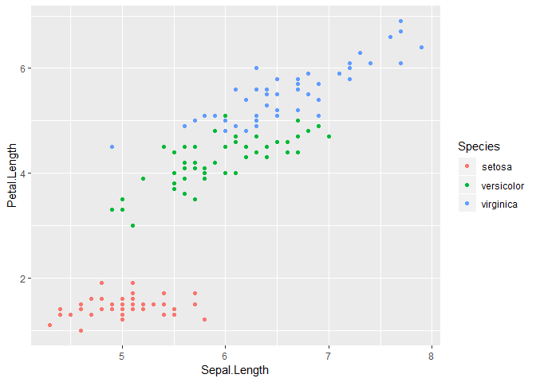

This is a test R Markdown Document
================
Gregory Vitz
March 15, 2019

R Markdown
----------

``` r
library(ggplot2)

data <- iris

ggplot(data, aes(Sepal.Length, Petal.Length, color = Species)) +
    geom_point()
```


